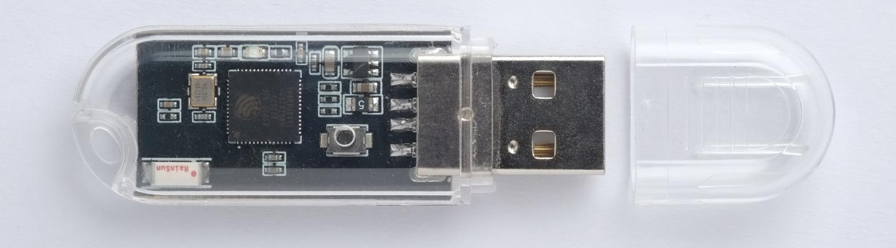

# Muse Lab ESP32-S2 Key 

*The Muse Lab ESP32-S2 Key is based on the ESP32-S2FH4 processor, with 4MB of flash, and it includes a Boot key and a ceramic antenna. It uses the ESP32-S2 built-in USB interface, so it doesn't need a separate USB-to-serial chip.* [Source](http://www.ulisp.com/show?523F)

